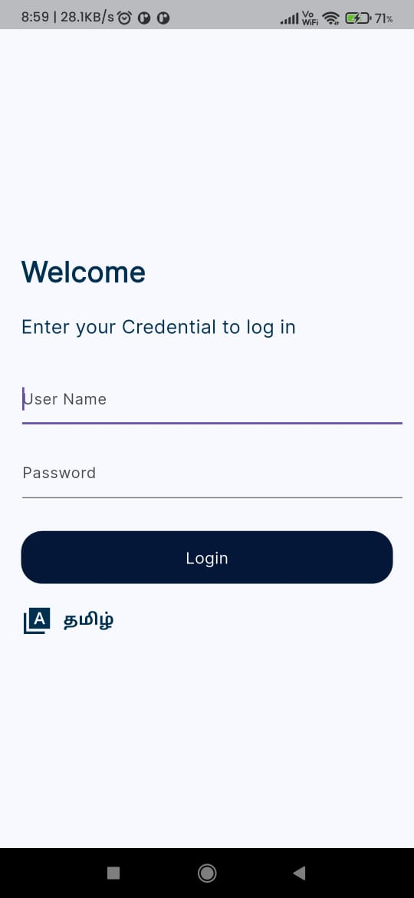
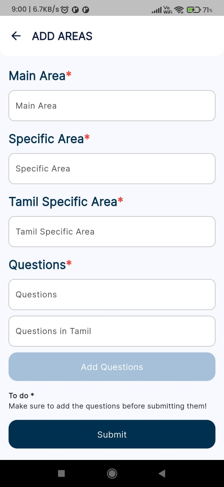
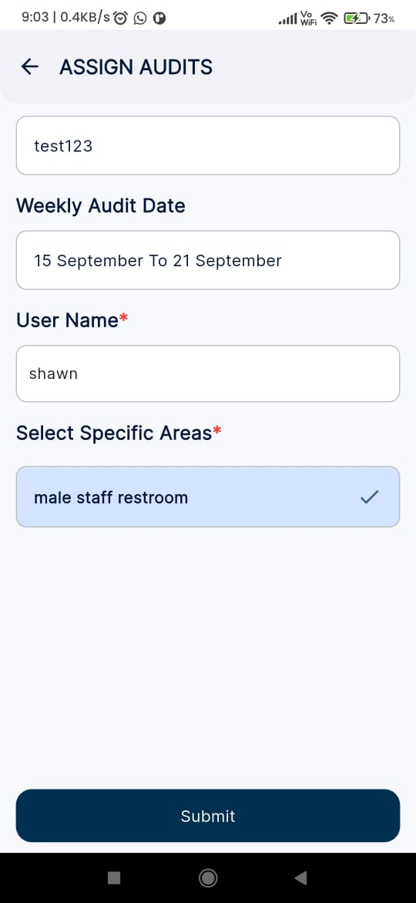
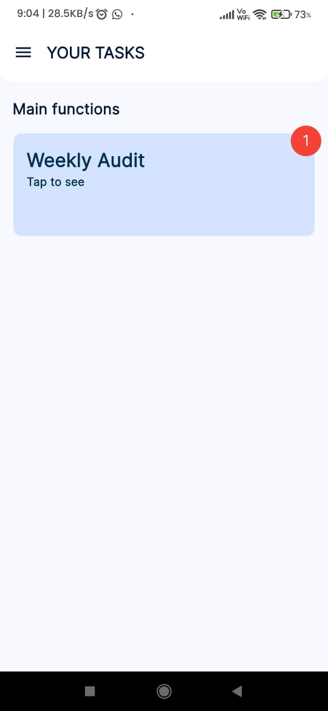

<!-- # auditfitnesstest

A new Flutter project.

## Getting Started

This project is a starting point for a Flutter application.

A few resources to get you started if this is your first Flutter project:

- [Lab: Write your first Flutter app](https://docs.flutter.dev/get-started/codelab)
- [Cookbook: Useful Flutter samples](https://docs.flutter.dev/cookbook)

For help getting started with Flutter development, view the
[online documentation](https://docs.flutter.dev/), which offers tutorials,
samples, guidance on mobile development, and a full API reference. -->

# Audit-Fitness [](http://makeapullrequest.com)

**A Flutter-based mobile application for managing weekly audits efficiently with real-time notifications and multi-language support.**

## Description

Audit-Fitness is a Flutter application designed to streamline weekly audit management. The admin assigns audits to users who inspect specific areas and submit responses marked as **“Good”** or **“Bad”**, along with images for reported issues. The admin can review submitted responses and assign tasks to the campus for resolution. This process continues iteratively until all issues are resolved.

Key highlights include:
- **Real-time notifications** using Firebase Messaging when tasks are assigned.
- **Multi-language support** (English and Tamil) for broader accessibility.

---

## Features

- **Audit Assignment**: Admin assigns weekly audits to users.
- **Area Inspection**: Users submit “Good” or “Bad” responses with image attachments.
- **Task Management**: Admin reviews audits and assigns tasks for campus resolution.
- **Real-Time Notifications**: Firebase Messaging integration keeps users informed instantly.
- **Multi-language Support**: Application supports both English and Tamil.
- **Responsive UI**: Built with Flutter to provide a smooth user experience.

---

## 📸 ScreenShots

| 1 | 2|
|------|-------|
|||

| 3 | 4|
|------|-------|
|||


### Installation

### Prerequisites

- Flutter SDK (latest stable version)
- Node.js (v14 or higher)
- MySQL server
- Firebase account for messaging setup


#### Clone the repo
   ```bash
   git clone https://github.com/VijayAdithP/Audit-Fitness.git
   cd Audit-Fitness
   ```
#### Set up the backend
   ```bash
   # Navigate to the backend folder
   cd audit-plan-backend-main
   ```
   ```bash
   # Install dependencies
   npm install
   ```

#### Set up the frontend
    ```bash
    # Install dependencies
    flutter pub get
    ```

#### Launch the app on an android device
   ```bash
   # lanch the app
   flutter run
   ```
